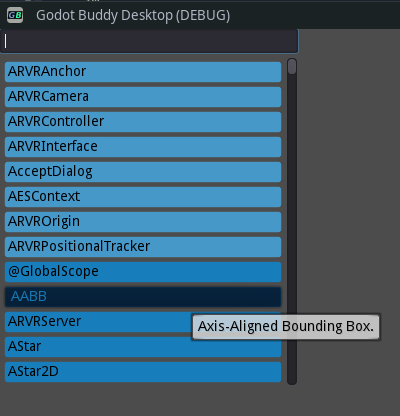

# Godot Buddy Website and Apps

The **website** uses the [HUGO](https://gohugo.io) static website generator.

The **Apps** are developed in the [Godot](godotengine.org) game engine.

## Tools

**Godot Buddy** will provide various useful tools for **Godot** game developers.

### Class Explorer

The **Class Explorer** is an advanced way to explore the available classes in the Godot API and to target the classes that interest you the most, and to attach your meta-data to them.

This is a work in progress ...
